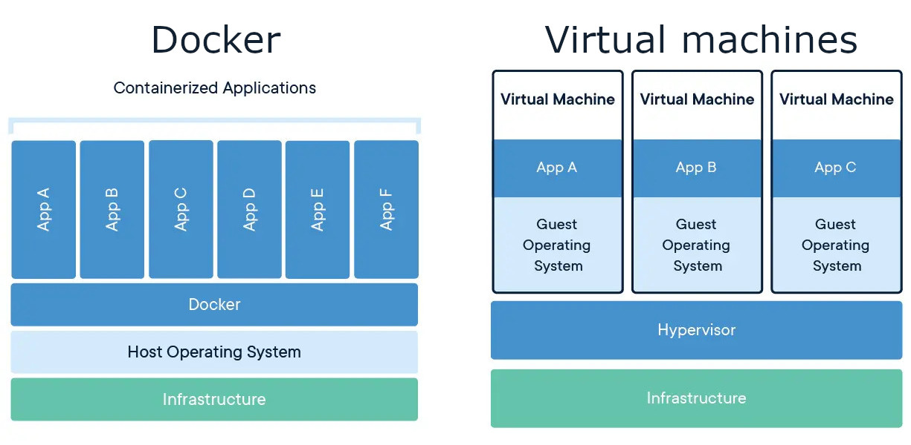
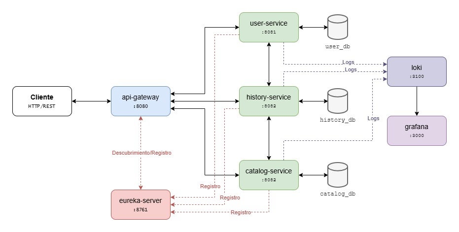

# Duoc Music Hub

¡Bienvenidos al proyecto **Duoc Music Hub**! Este es un entorno de aprendizaje diseñado para estudiantes de **Desarrollo Full Stack I** que buscan dominar la arquitectura de microservicios utilizando el ecosistema de **Spring Cloud**, **Maven**, **Docker**, y herramientas de observabilidad moderna.

---

- [Duoc Music Hub](#duoc-music-hub)
  - [Descripción](#descripción)
  - [Conceptos clave](#conceptos-clave)
    - [Microservicios](#microservicios)
    - [Eureka Server (Service Discovery)](#eureka-server-service-discovery)
    - [API Gateway](#api-gateway)
    - [HATEOAS](#hateoas)
    - [Swagger / OpenAPI 3](#swagger--openapi-3)
    - [Pruebas unitarias](#pruebas-unitarias)
    - [Loki + Grafana](#loki--grafana)
    - [Docker y Docker Compose](#docker-y-docker-compose)
      - [¿Qué es Docker?](#qué-es-docker)
      - [¿Qué es Docker Compose?](#qué-es-docker-compose)
    - [Variables de entorno](#variables-de-entorno)
  - [Requisitos previos](#requisitos-previos)
  - [Acerca del proyecto](#acerca-del-proyecto)
    - [Arquitectura](#arquitectura)
    - [Stack tecnológico](#stack-tecnológico)
    - [Estructura del monorepo](#estructura-del-monorepo)
    - [Orden de construcción](#orden-de-construcción)
    - [Ejecución con Docker Compose](#ejecución-con-docker-compose)
  - [Autor](#autor)
  - [Licencia](#licencia)

## Descripción

Proyecto de ejemplo educativo para la asignatura **Desarrollo Full Stack I (DSY1103)** de **Duoc UC**. Implementa una arquitectura de microservicios con `Java` + `Spring Boot`, cubriendo registro de servicios, enrutamiento inteligente, comunicación inter-servicio, documentación de API, trazabilidad de logs y contenedorización.

El objetivo pedagógico es demostrar, en un contexto acotado y comprensible, los patrones más relevantes de una arquitectura de microservicios moderna:

- Registro y descubrimiento dinámico de servicios con `Eureka`
- Punto de entrada único para los clientes utilizando `API Gateway`
- Comunicación sincrónica entre microservicios mediante `WebClient`
- Documentación interactiva de API con la especificación `OpenAPI 3` y la herramienta `Swagger`
- Navegación por hipervínculos en las respuestas usando `HATEOAS`
- Pruebas unitarias con `JUnit 5` y `Mockito`
- Centralización de logs con `Loki` + `Grafana`
- Contenedorización y orquestación con `Docker` y `Docker Compose`

## Conceptos clave

### Microservicios

Los microservicios son un **enfoque arquitectónico de software** donde una aplicación grande se divide en servicios pequeños, autónomos y especializados. Cada uno ejecuta un proceso empresarial único, gestiona su propia base de datos y se comunica con los demás a través de interfaces estandarizadas (API).

**¿Cómo funcionan?**

A diferencia de las aplicaciones monolíticas (donde todo el código está acoplado en un solo bloque), los microservicios operan como piezas independientes.

- **Despliegue independiente:** Se pueden actualizar, modificar o escalar sin alterar el resto de la aplicación.
- **Tecnología flexible:** Los equipos pueden utilizar diferentes lenguajes de programación y bases de datos para cada servicio.

**Ventajas Principales:**

- **Escalabilidad:** Permite asignar más recursos (hardware o memoria) únicamente a los servicios que soportan mayor tráfico, optimizando costos.
- **Resiliencia y aislamiento de fallos:** Si un microservicio presenta un error o se cae, el sistema general no colapsa; el fallo se aísla en esa función específica.
- **Agilidad para los equipos:** Equipos reducidos de desarrollo pueden trabajar en servicios diferentes en paralelo, acelerando el tiempo de lanzamiento de nuevas funciones.

**Desafíos a Considerar:**

- **Complejidad distribuida:** Al tener múltiples piezas móviles, gestionar la red, el registro y la monitorización requiere herramientas avanzadas (como Kubernetes).
- **Latencia de red:** La comunicación entre servicios a través de la red puede ser ligeramente más lenta que las llamadas internas de memoria en un monolito.
- **Pruebas complejas:** Testear el sistema en su conjunto requiere una infraestructura más robusta.

### Eureka Server (Service Discovery)

Un **Eureka Server** es un componente de registro y descubrimiento de servicios desarrollado por **Netflix** y adaptado por **Spring Cloud**. Funciona como un directorio centralizado donde los microservicios se registran automáticamente al iniciar, permitiéndoles localizarse entre sí por su nombre lógico en lugar de requerir direcciones IP estáticas.

**Funcionalidad Principal:**

- **Registro Dinámico:** Cuando un microservicio (**Eureka Client**) sube o se escala, informa al servidor su ubicación (host y puerto).
- **Descubrimiento:** Permite a un microservicio preguntar al servidor dónde encontrar a otro servicio con el que necesita comunicarse.
- **Salud y Resiliencia:** Los clientes envían señales periódicas (latidos o *heartbeats*). Si una instancia falla, el servidor la elimina del registro para evitar errores de conexión.

**El ciclo de vida de un servicio en Eureka:**

En **Eureka**, el ciclo de vida de un microservicio es gestionado automáticamente para mantener un mapa de red coherente. El proceso comprende 4 etapas clave en su interacción con el servidor central:

1. **Registro (Registration):** Cuando un microservicio (como cliente Eureka) se levanta, se conecta a la URL del servidor Eureka (por defecto <http://localhost:8761/eureka>). En este paso, el servicio proporciona su identificador único (*Application Name*), dirección IP, puerto y estado (*UP*). A partir de este momento, está disponible para recibir peticiones de otros microservicios.
2. **Renovación (Renewals):** Para garantizar que el registro esté actualizado, el cliente envía un "latido" (*heartbeat*) al servidor cada 30 segundos. Esto le indica a Eureka que el servicio se encuentra en buen estado (*healthy*) y capaz de procesar peticiones. Si falla el envío de este latido, su estado puede cambiar.
3. **Expiración y Evicción (Eviction):** Eureka Server implementa un mecanismo a prueba de fallos. Si un microservicio se cae de manera abrupta (por ejemplo, un fallo de red o un apagado imprevisto) y deja de enviar sus latidos de renovación, el servidor Eureka lo considera fuera de servicio. El servidor cuenta con un umbral para proteger los servicios activos conocido como autopreservación; si se pierden demasiados latidos inesperadamente, Eureka retiene el registro por seguridad en lugar de eliminarlo de golpe.
4. **Baja (Cancellation):** Cuando un microservicio se apaga de forma controlada (por ejemplo, un cierre elegante o *graceful shutdown*), ejecuta un proceso de cancelación. El cliente envía una petición explícita de baja (*DELETE*) al servidor Eureka. El servidor lo elimina inmediatamente del registro de servicios activos para que ningún otro cliente intente comunicarse con una instancia inactiva.

**Conceptos importantes:**

| Concepto                   | Descripción                                                                                                            |
|:---------------------------|:-----------------------------------------------------------------------------------------------------------------------|
| **Eureka Server**          | El servidor central que mantiene el registro de todos los servicios.                                                   |
| **Eureka Client**          | Cualquier microservicio que se registra en el servidor.                                                                |
| **Registry**               | El mapa en memoria: `nombre-servicio → [instancia1, instancia2, ...]`.                                                 |
| **Heartbeat**              | Señal periódica (30s) que el cliente envía para indicar que sigue activo.                                              |
| **Self-preservation mode** | Modo de seguridad: si muchos clientes dejan de enviar heartbeats, Eureka asume un problema de red y no los da de baja. |

### API Gateway

Punto de entrada único para todos los clientes externos. Recibe las peticiones, las enruta al microservicio correspondiente (consultando Eureka) y puede aplicar filtros transversales como autenticación, rate limiting, CORS o logging. En este proyecto se usa **Spring Cloud Gateway**.

**¿Qué problemas resuelve?**

En una arquitectura moderna, una sola aplicación se divide en múltiples servicios independientes (microservicios). Sin un **API Gateway**, un cliente tendría que llamar a cada servicio por separado, lo que trae problemas de seguridad, sobrecarga de red y complejidad.

El **API Gateway** centraliza estas operaciones actuando como un "recepcionista inteligente":

- **Enrutamiento:** Recibe la petición del usuario y la redirige al microservicio correcto.
- **Seguridad y Autenticación:** Verifica si el usuario tiene permiso (tokens o llaves) antes de dejarlo pasar.
- **Limitación de velocidad (Rate limiting):** Controla cuántas peticiones puede hacer un usuario, evitando que el sistema se sobrecargue.
- **Traducción de protocolos:** Convierte formatos de comunicación (ej. de HTTP a REST) según lo necesite el servicio interno.
- **Agregación de respuestas:** Combina la información de varios microservicios en una sola respuesta simplificada para el cliente.

### HATEOAS

**HATEOAS** (por sus siglas en inglés, *Hypermedia as the Engine of Application State* o *Hipermedia como motor del estado de la aplicación*) es una restricción fundamental del diseño de arquitecturas REST. Permite a los clientes navegar por una API y descubrir acciones disponibles de forma dinámica utilizando enlaces (hipermedia) devueltos por el propio servidor.

**¿Por qué utilizar HATEOAS?**

En lugar de depender de documentación estática o de rutas cableadas manualmente (*hardcodeadas*), **HATEOAS** ofrece beneficios clave:

- **Independencia del cliente:** El cliente no necesita conocer de antemano todas las URLs de la API. Solo requiere saber la dirección base. El servidor le indica qué hacer a continuación.
- **Flexibilidad de evolución:** Si el backend cambia la estructura de sus rutas (por ejemplo, pasa de /usuarios a /v2/clientes), el cliente no se rompe porque recibe las URLs correctas directamente en la respuesta.
- **Autodescripción:** Las respuestas del servidor muestran exactamente los recursos y las acciones (como crear, actualizar, eliminar) que son válidas para el estado actual de los datos.

**Ejemplo Práctico:**

Imagina que haces una petición para obtener los datos de una factura en un estado pendiente de pago.

Una API tradicional sin **HATEOAS** te devolvería simplemente:

```json
{
  "id": 123,
  "monto": 150.00,
  "estado": "pendiente"
}
```

Una API que aplica el principio **HATEOAS** te devolvería esos mismos datos, junto con una sección de enlaces con las siguientes acciones posibles:

```json
{
  "id": 123,
  "monto": 150.00,
  "estado": "pendiente",
  "links": [
    {
      "rel": "self",
      "href": "https://empresa.com"
    },
    {
      "rel": "pagar",
      "href": "https://empresa.com/pagar"
    },
    {
      "rel": "cancelar",
      "href": "https://empresa.com/cancelar"
    }
  ]
}
```

### Swagger / OpenAPI 3

**OpenAPI** es el estándar o especificación técnica (el "plano" escrito en `JSON` o `YAML`) que define cómo debe describirse una **API REST**, mientras que **Swagger** es el conjunto de herramientas de software (creado por **SmartBear**) que permite implementar, documentar y probar dichas APIs basándose en el estándar **OpenAPI**.

**Diferencias Clave:**

- **OpenAPI:** Es el contrato. Es un formato de descripción neutral e independiente del lenguaje que detalla las rutas, parámetros y respuestas de una API. En 2016, la especificación de Swagger fue donada a la OpenAPI Initiative (bajo la Fundación Linux) y pasó a llamarse *Especificación OpenAPI*.
- **Swagger:** Son las herramientas. Incluye el entorno de desarrollo visual, la interfaz gráfica interactiva y los generadores de código que facilitan el trabajo con las descripciones **OpenAPI**.

### Pruebas unitarias

Las pruebas unitarias (o unit tests) son la práctica de desarrollo donde se prueba la unidad más pequeña y funcional del código (como una función o un método) de forma aislada. Su objetivo es verificar que cada componente opere exactamente como se espera antes de integrarlo con el resto del sistema.

**¿Por qué son fundamentales?**

- **Detección temprana:** Permiten identificar y solucionar errores de inmediato, lo que resulta mucho más económico y rápido que corregirlos en etapas avanzadas.
- **Aislamiento:** Se prueban módulos específicos sin depender de bases de datos, redes u otras dependencias externas.
- **Automatización:** Se ejecutan de forma repetitiva y automática para garantizar que los cambios en el código no rompan funcionalidades ya existentes.

### Loki + Grafana

**Grafana Loki** es un sistema de agregación de *logs* (registros) altamente escalable, diseñado para ser eficiente en costos e inspirado en **Prometheus**. A diferencia de otras plataformas, **Loki** no indexa el contenido completo de los mensajes, sino únicamente los metadatos o etiquetas (*labels*), optimizando así el almacenamiento.

Para construir una pila de observabilidad completa, este sistema suele trabajar en conjunto con **Grafana** (para visualización) y un agente recolector.

**Componentes Clave de la Pila:**

- **Agente Recolector (*Promtail*):** Es la herramienta instalada en tus servidores o contenedores que se encargan de leer, transformar, etiquetar y enviar tus logs hacia **Loki**. En el caso de nuestro proyecto, usaremos **Loki4j**.
- **Loki:** Es el motor central que recibe, organiza y almacena tus registros. Puede integrarse directamente con servicios de almacenamiento en la nube para gestionar grandes volúmenes de datos.
- **Grafana:** Es la interfaz gráfica que se conecta a Loki como fuente de datos. Utiliza LogQL, el lenguaje de consultas específico de Loki, para filtrar, agrupar y visualizar tus logs en tiempo real.

### Docker y Docker Compose

#### ¿Qué es Docker?

Docker es una plataforma que permite empaquetar una aplicación junto con todo lo que necesita para funcionar, como bibliotecas, configuraciones y dependencias, dentro de una unidad llamada **contenedor**.

Un contenedor es un entorno aislado que garantiza que una aplicación se ejecute de la misma manera en cualquier computador o servidor, independientemente del sistema operativo o de las configuraciones existentes.

**Ventajas de Docker:**

- Facilita la instalación y ejecución de aplicaciones.
- Evita problemas de compatibilidad entre entornos.
- Permite trabajar con entornos aislados y controlados.
- Simplifica el despliegue de aplicaciones en servidores.
- Favorece el trabajo colaborativo entre desarrolladores.

**¿Docker es lo mismo que una Máquina Virtual?**

Una confusión frecuente es pensar que **Docker** funciona igual que una **máquina virtual**. Aunque ambas tecnologías permiten aislar aplicaciones y entornos de ejecución, su funcionamiento es diferente.

Las máquinas virtuales simulan un computador completo, incluyendo su propio sistema operativo. Esto significa que cada máquina virtual debe cargar y ejecutar un sistema operativo independiente, lo que aumenta el consumo de recursos.

Docker, en cambio, utiliza contenedores que comparten el sistema operativo del equipo anfitrión. Cada contenedor incluye únicamente los componentes necesarios para ejecutar una aplicación, por lo que son más ligeros y rápidos de iniciar.

| Máquinas Virtuales                                  | Contenedores Docker                            |
|:----------------------------------------------------|:-----------------------------------------------|
| Incluyen un sistema operativo completo              | Comparten el sistema operativo anfitrión       |
| Consumen más memoria y almacenamiento               | Consumen menos recursos                        |
| Tienen tiempos de inicio más lentos                 | Inician en pocos segundos                      |
| Son más pesadas y complejas de administrar          | Son ligeras y fáciles de desplegar             |
| Ideales para ejecutar distintos sistemas operativos | Ideales para ejecutar aplicaciones y servicios |



#### ¿Qué es Docker Compose?

**Docker Compose** es una herramienta que permite administrar y ejecutar varios contenedores relacionados entre sí de forma sencilla.

En proyectos reales, una aplicación suele estar compuesta por varios servicios, por ejemplo:

- Una aplicación web.
- Una base de datos.
- Un servidor de autenticación.
- Un sistema de almacenamiento en caché.

**Docker Compose** permite definir todos estos servicios en un único archivo de configuración y ejecutarlos juntos con un solo comando.

**Ventajas de Docker Compose:**

- Simplifica la administración de múltiples contenedores.
- Permite configurar entornos completos de desarrollo.
- Facilita la puesta en marcha de aplicaciones complejas.
- Reduce errores de configuración manual.
- Mejora la reproducibilidad de los entornos de trabajo.

**Diferencias entre Docker y Docker Compose:**

| Docker                                  | Docker Compose                                                         |
|:----------------------------------------|:-----------------------------------------------------------------------|
| Gestiona contenedores individuales      | Gestiona múltiples contenedores relacionados                           |
| Permite crear y ejecutar contenedores   | Permite coordinar varios servicios simultáneamente                     |
| Se utiliza para empaquetar aplicaciones | Se utiliza para orquestar aplicaciones compuestas por varios servicios |

### Variables de entorno

Una variable de entorno es un valor dinámico almacenado en el sistema operativo (o entorno de ejecución) que indica a los programas cómo deben comportarse o dónde encontrar ciertos recursos. Son fundamentales para configurar aplicaciones y proteger datos sensibles sin modificar el código fuente.

**¿Para qué sirven?**

- **Configuración:** Permiten que un mismo programa se adapte según el entorno donde se ejecuta (por ejemplo, conectarse a una base de datos local en tu PC y a una base de datos de producción en el servidor).
- **Seguridad:** Se utilizan para ocultar información confidencial (como claves API, contraseñas o tokens) evitando que se suban a repositorios públicos de código.
- **Rutas del sistema:** Ayudan al sistema operativo a saber dónde ubicar los archivos temporales, el editor de texto predeterminado o los programas ejecutables (como la variable global PATH).

**Tipos comunes:**

Encontrarás diferentes tipos de variables según el contexto:

- **Del Sistema/Usuario:** Configuran aspectos del sistema operativo (idioma, ruta a la carpeta de usuario, etc.).
- **De Aplicación:** Son definidas específicamente para un programa web o servicio (por ejemplo, el puerto en el que corre el servidor, la URL de una API).

**¿Cómo se usan?**

- **En desarrollo local:** Por lo general, se guardan en un archivo de texto plano llamado `.env` en la raíz de tu proyecto.
- **En producción:** En lugar de archivos `.env`, los servicios de alojamiento (como **Vercel**, **AWS** o plataformas similares) tienen interfaces nativas para configurar estas variables de forma segura.

> [!TIP]
> Los nombres de las variables de entorno se escriben tradicionalmente en **MAYÚSCULAS** y separando palabras con guiones bajos (ej. `DATABASE_URL`).

## Requisitos previos

Antes de comenzar, asegúrate de tener instalado:

- **JDK 21** o superior
- **Maven 3.8+** o usar el wrapper `./mvnw` incluido en cada módulo
- **Docker Desktop** con Docker Compose integrado
- **Git**
- IDE recomendado: **IntelliJ IDEA** o **VS Code** con extensiones *Extension Pack for Java* y *Spring Boot Extension Pack*

Verifica tu entorno:

```bash
java -version           # openjdk 21.x.x
mvn -version            # Apache Maven 3.8.x
docker -version         # Docker version 29.x.x
docker compose version  # Docker Compose version v5.x.x
```

## Acerca del proyecto

### Arquitectura

La siguiente imagen representa la arquitectura del proyecto, basada en **microservicios**, con un enfoque de desarrollo de software que divide una aplicación en múltiples servicios independientes, cada uno responsable de una funcionalidad específica del negocio.



El flujo de funcionamiento comienza cuando un cliente realiza una solicitud HTTP/REST al sistema. Todas las peticiones ingresan a través del **API Gateway**, que actúa como punto de entrada único para los consumidores de la API.

Una vez recibida la solicitud, el API Gateway determina qué microservicio debe procesarla y la redirige al servicio correspondiente. Para conocer la ubicación de cada servicio utiliza un mecanismo de descubrimiento proporcionado por **Eureka Server**, donde los microservicios se registran automáticamente al iniciar.

La arquitectura está compuesta por tres microservicios principales:

- **User Service**, encargado de la gestión de usuarios.
- **History Service**, responsable del historial de acciones o eventos.
- **Catalog Service**, encargado de administrar la información del catálogo.

Cada microservicio posee su propia base de datos, lo que permite mantener la independencia de los datos y reducir el acoplamiento entre componentes. Esta práctica es una de las características fundamentales de las arquitecturas basadas en microservicios.

Además de la funcionalidad de negocio, la solución incorpora un sistema de observabilidad. Los microservicios generan registros de actividad (**logs**) que son enviados a **Loki**, una plataforma especializada en almacenamiento y centralización de logs. Posteriormente, estos registros pueden visualizarse y analizarse mediante **Grafana**, permitiendo monitorear el comportamiento de la aplicación y detectar posibles problemas de forma temprana.

### Stack tecnológico

| Componente         | Tecnología                  |
|:-------------------|:----------------------------|
| Lenguaje           | Java                        |
| Framework          | Spring Boot                 |
| Service Discovery  | Spring Cloud Netflix Eureka |
| API Gateway        | Spring Cloud Gateway        |
| Persistencia       | Spring Data JPA             |
| Base de datos      | H2 (test) - MySQL8 (dev)    |
| Documentación API  | springdoc-openapi           |
| HATEOAS            | Spring HATEOAS              |
| Pruebas            | JUnit 5 + Mockito           |
| Logs               | Logback + Loki4j            |
| Visualización logs | Grafana + Loki              |
| Contenedores       | Docker + Docker Compose     |

### Estructura del monorepo

El proyecto está construido como un **monorepo**, es decir, se almacena el código fuente de todos los servicios en un solo repositorio.

| Nombre del Servicio                  | Descripción                                                    |
|:-------------------------------------|:---------------------------------------------------------------|
| [`eureka-server`](eureka-server)     | Registra las instancias activas de los microservicios          |
| [`api-gateway`](api-gateway)         | Se encarga de redirigir el tráfico hacia el servicio correcto  |
| [`user-service`](user-service)       | Administra los perfiles de los oyentes                         |
| [`catalog-service`](catalog-service) | Gestiona el inventario musical global de la plataforma         |
| [`history-service`](history-service) | Registra los eventos de reproducción                           |

La estructura de carpetas es la siguientes:

```plaintext
duoc-music-hub/
├── api-gateway/
│   └── src/
│       └── main/
│           ├── java/
│           └── resources/
├── catalog-service/
│   └── src/
│       ├── main/
│       │   ├── java/
│       │   └── resources/
│       └── test/
├── eureka-server/
│   └── src/
│       └── main/
│           ├── java/
│           └── resources/
├── history-service/
│   └── src/
│       ├── main/
│       │   ├── java/
│       │   └── resources/
│       └── test/
└── user-service/
    └── src/
        ├── main/
        │   ├── java/
        │   └── resources/
        └── test/
```

### Orden de construcción

Para construir este ecosistema de forma exitosa, seguiremos este orden lógico de desarrollo:

1. **Fase 1: Infraestructura Base (MySQL, Loki & Grafana):** Crear los servidores de base de datos y observabilidad.

   - Renombrar el archivo `.env.example` por `.env` y completar la siguiente información:

     ```env
     DATABASE_ROOT_PASSWORD=<contraseña_superusuario>

     EUREKA_HOST=<servidor_eureka>
     EUREKA_SERVER_URL=<url_servidor_eureka>

     GRAFANA_ADMIN_USER=<usuario_grafana>
     GRAFANA_ADMIN_PASSWORD=<contraseña_grafana>
     ```

     > [!IMPORTANT]
     > El valor de `<contraseña_superusuario>` corresponde a la contraseña del usuario `root` de la base de datos. El valor `<servidor_eureka>` debe ser reemplazado con el nombre del servidor Eureka y `<url_servidor_eureka>`, con la URL completa de servidor; en este caso, se debe mantener el nombre del servicio declarado en el archivo `compose.yaml` (por ejemplo, `eureka`). Los valores `<usuario_grafana>` y `<contraseña_grafana>` corresponden al usuario administrador del servidor Grafana y su contraseña, respectivamente.

   - Crear el archivo `compose.yaml` en la raíz del proyecto:

     ```yaml
     services:
       # Declaración del servidor de base de datos
       mysql:
         image: mysql:8.4.9-oraclelinux9
         environment:
           - MYSQL_ROOT_PASSWORD=${DATABASE_ROOT_PASSWORD}
         ports:
           - "3306:3306"
         volumes:
           - mysql-data:/var/lib/mysql
           - ./init.sql:/docker-entrypoint-initdb.d/init.sql
         healthcheck:
           test: ["CMD", "mysqladmin", "ping", "-h", "localhost", "-u", "root", "-p${DATABASE_ROOT_PASSWORD}"]
           interval: 10s
           timeout: 5s
           retries: 5
         networks:
           - subnet

       # Declaración del servidor Loki
       loki:
         image: grafana/loki:latest
         ports:
           - "3100:3100"
         command: -config.file=/etc/loki/local-config.yaml
         volumes:
           - loki-data:/loki
         healthcheck:
           test: ["CMD", "loki", "-version"]
           interval: 15s
           timeout: 5s
           retries: 5
         networks:
           - subnet
       
       # Declaración del servidor Grafana
       grafana:
         image: grafana/grafana:latest
         ports:
           - "3000:3000"
         environment:
           - GF_SECURITY_ADMIN_USER=${GRAFANA_ADMIN_USER}
           - GF_SECURITY_ADMIN_PASSWORD=${GRAFANA_ADMIN_PASSWORD}
         volumes:
           - grafana-data:/var/lib/grafana
         depends_on:
           loki:
             condition: service_healthy
         healthcheck:
           test: ["CMD", "wget", "-qO-", "http://localhost:3000/api/health"]
           interval: 15s
           timeout: 5s
           retries: 5
         networks:
           - subnet

     # Declaración de los volúmenes
     volumes:
       mysql-data:
       loki-data:
       grafana-data:

     # Declaración de las redes
     networks:
       subnet:
         driver: bridge
     ```

   - Configurar el datasource de Loki en Grafana para buscar trazas distribuidas.

2. **Fase 2: Infraestructura Base (Eureka Server):** Crear el servidor de descubrimiento para que la red exista.
3. **Fase 3: Servicios de Negocio (Catalog, User & History):** Desarrollar la lógica, persistencia en MySQL, hipermedios (HATEOAS) y la comunicación síncrona mediante `WebClient`.
4. **Fase 4: Pruebas Unitarias y de Integración:** Asegurar la calidad del código usando Mockito y MockWebServer antes de desplegar.
5. **Fase 5: Puerta de Entrada (API Gateway):** Exponer los servicios a través de una ruta única y centralizada.
6. **Fase 6: Contenerización y Orquestación (Docker):** Crear los `Dockerfile` para cada servicio y unificar todo el ecosistema en el archivo `compose.yaml` generado al principio.

### Ejecución con Docker Compose

Una vez construidos todos los módulos, el entorno completo se levanta con Docker Compose:

```bash
# Levanta todos los servicios
docker compose up

# Levanta todos los servicios, pero en segundo plano
docker compose up -d

# Levanta todos los servicios, forzando la construcción de las imágenes
docker compose up --build

# Levanta todos los servicios en segundo plano, forzando la construcción de las imágenes
docker compose up --build

# Levanta solo el servicio especificado en segundo plano
docker compose up -d <nombre_del_servicio>
```

Esto levantará los servicios en el siguiente orden: `mysql` → `loki` → `grafana` → `eureka-server` → `user-service` → `catalog-service` → `history-service` → `api-gateway`.

> [!IMPORTANT]
> La primera vez que se levanta el entorno, puede tardar unos minutos en que descargue las imágenes de Docker correspondientes. Luego, los servicios se levantaran en el orden descrito.

Para detener todo:

```bash
# Elimina los servicios manteniendo los volúmenes
docker compose down

# Elimina todo, incluyendo los volúmenes
docker compose down -v
```

## Autor

José Miguel Candia - [📧 Correo](mailto:jo.candiah@profesor.duoc.cl) | [🌐 GitHub](https://github.com/jmcandia)

## Licencia

Este proyecto está bajo la Licencia [MIT](LICENSE).
